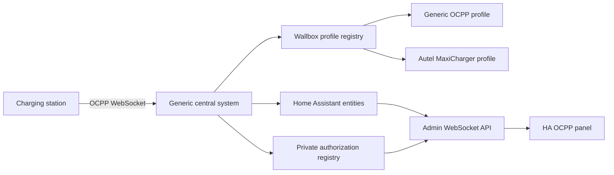

# HA OCPP Architecture

HA OCPP keeps the protocol core, wallbox-specific behavior, Home Assistant
entities, and the management UI in separate layers.

## Boundaries

`api.py`, `chargepoint.py`, and the version-specific handlers implement generic
OCPP behavior. A charger that matches no product profile must still work here.

`wallbox_profiles/` contains declarative identity matching, capability hints,
and narrowly scoped value normalization. Profiles must not duplicate the OCPP
client or create parallel entity implementations.

`dashboard.py` exposes an administrator-only WebSocket API. Complete RFID
tokens remain in Home Assistant private storage; the API returns masked values
and stable record identifiers only.

`frontend/ha-ocpp-panel.js` is a native Home Assistant custom panel. It consumes
the admin API while regular Home Assistant entities remain available for
dashboards and automations.

## Compatibility

The Home Assistant integration domain remains `ocpp`. This is a compatibility
contract for existing config entries, entity unique IDs, services, and stored
authorization data; it does not imply a dependency on another repository.
